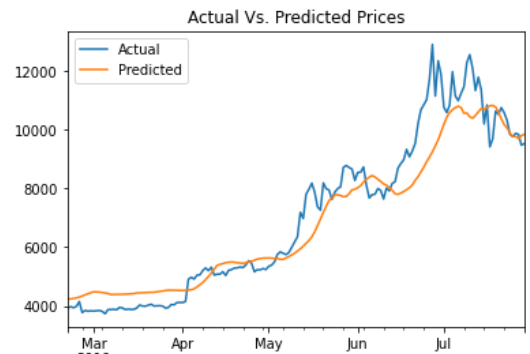

# Unit 14 Homework: LSTM Stock Predictor - Rachel Pierce
## December 2021

## *Instructions:*
### Three main tasks:
1. Prepare the data for training and testing
2. Build and train customer LSTM RNNs
3. Evaluate the performance of each model

#
## *Please refer to the following documents in GitHub:*
- The **lstm_stock_predictor_closing.ipynb** and **lstm_stock_predictor_fng.ipynb** files (open in Jupyter Lab) for code details.

#

## Step 1: Prepare the data for training and testing
Completed.
## Step 2: Build and train custom LSTM RNNs
Completed.
## Step 3: Evaluate the performace of each model
Completed.
1. Which model has a lower loss?  
The first model (closing) has a lower loss.
2. Which model tracks the actual values better over time?  
The first model (closing) tracks the actual values better over time, as shown in the graph below.   

    

3. Which window size works best for the model?  
I tested 1-10 for the window size, and 1 caused the predicted orange line to be significantly off, so 10 works best as the predicted orange line better tracks with the actual blue line on the graph (as shown above).

